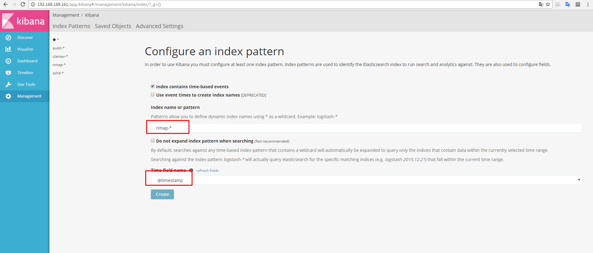

# Kết quả trên Kibana

### Để xem kết quả thì vào Mannagement -> Index Patters -> add new và điền thông tin như trong hình

Sau đó có thể xem kết quả trong Discover

### Tạo báo cáo trên kibana

Trong Discover tìm kiếm với từ khóa `*Pots` rồi lưu lại với tên `nmap-results` để xem kết quả quét được

Tiếp tục với từ khóa `*done*` để xem thời gian quét xong, quét bao nhiêu host, quét trong bao lâu, lưu với tên `Scan Done`

Vào Dashboard chọn add -> Saved Search add `Scan Done` và `nmap-results` và lưu lại với tên `Nmap-report`

Báo cáo 

 
